# MarkDown Builder 操作手冊

> 適用版本：v1.7 以上　｜　適用系統：Windows 10 / 11

MarkDown Builder 是一套編輯與瀏覽 Markdown 文件的工具：左邊寫、右邊即時看到排版結果，還能把 Word、Excel、PDF 等文件轉成 Markdown，或把 Markdown 匯出成 PDF、Word 交給其他人。

## 目錄

1. [安裝與第一次啟動](#1-安裝與第一次啟動)
2. [畫面介紹](#2-畫面介紹)
3. [工具列按鈕](#3-工具列按鈕)
4. [開啟與儲存檔案](#4-開啟與儲存檔案)
5. [多分頁](#5-多分頁)
6. [撰寫 Markdown](#6-撰寫-markdown)
7. [檢視模式](#7-檢視模式)
8. [圖表與數學公式](#8-圖表與數學公式)
9. [匯出 PDF / Word](#9-匯出-pdf--word)
10. [把 Word、Excel、PDF 轉成 Markdown](#10-把-wordexcelpdf-轉成-markdown)
11. [設為預設程式](#11-設為預設程式)
12. [自動更新](#12-自動更新)
13. [切換介面語言](#13-切換介面語言)
14. [快捷鍵一覽](#14-快捷鍵一覽)
15. [常見問題](#15-常見問題)

---

## 1. 安裝與第一次啟動

MarkDown Builder **不需要安裝**，只有一個檔案 `MarkDownBuilder.exe`。

1. 把 `MarkDownBuilder.exe` 複製到自己電腦上的任何資料夾（建議放在「文件」或桌面以外的固定位置，例如 `D:\Tools\`）。
2. 雙擊 `MarkDownBuilder.exe` 啟動。
3. 第一次啟動時，程式會詢問是否要設為 `.md` 檔的預設開啟程式：

   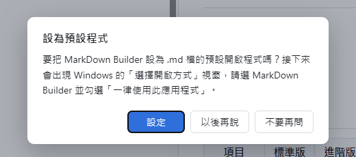

   - **設定**：接著會出現 Windows 的「選擇開啟方式」視窗，選 **MarkDown Builder** 並勾選「**一律使用此應用程式**」。之後雙擊 `.md` 檔就會直接用本程式開啟。
   - **以後再說**：這次先不設定，下次啟動會再問。
   - **不要再問**：不再詢問（之後仍可從狀態列設定，見 [第 11 節](#11-設為預設程式)）。

> 💡 如果 Windows 顯示「Windows 已保護您的電腦」（SmartScreen），請點「其他資訊」→「仍要執行」。這是因為程式沒有購買數位簽章，並非病毒。若公司防毒軟體攔截，請洽 IT 人員。

---

## 2. 畫面介紹

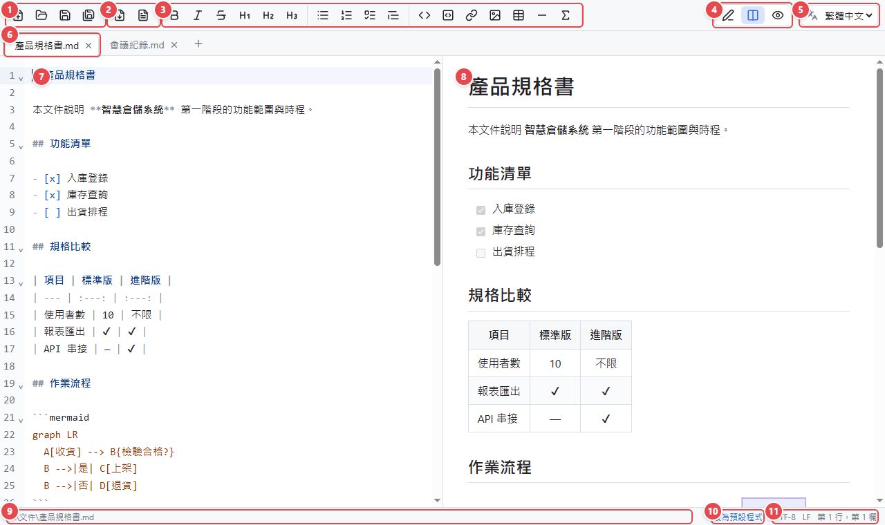

| 編號 | 區域 | 說明 |
| :---: | --- | --- |
| 1 | 檔案 | 新增分頁、開啟、儲存、另存新檔 |
| 2 | 匯出 | 匯出 PDF、匯出 Word |
| 3 | 格式工具 | 粗體、標題、清單、表格、公式等排版按鈕 |
| 4 | 檢視模式 | 只編輯／左右分割／只預覽 |
| 5 | 介面語言 | 繁體中文／English |
| 6 | 分頁列 | 每份開啟的文件一個分頁 |
| 7 | 編輯區 | 撰寫 Markdown 原始文字，有語法上色與行號 |
| 8 | 預覽區 | 即時顯示排版結果，捲動時與編輯區同步 |
| 9 | 檔案路徑 | 目前文件的完整位置 |
| 10 | 設為預設程式 | 尚未設為 `.md` 預設程式時才會出現 |
| 11 | 文件資訊 | 編碼（UTF-8）、換行格式（LF / CRLF）、游標所在行與欄 |

將滑鼠停在任何按鈕上，會顯示按鈕名稱與快捷鍵。

---

## 3. 工具列按鈕

### 檔案與匯出

| 按鈕 | 名稱 | 快捷鍵 | 說明 |
| :---: | --- | --- | --- |
|  | 新增分頁 | `Ctrl+N` | 開一個空白的新分頁 |
|  | 開啟 | `Ctrl+O` | 開啟檔案，可一次選多個 |
|  | 儲存 | `Ctrl+S` | 儲存目前分頁；新文件會詢問存檔位置 |
|  | 另存新檔 | `Ctrl+Shift+S` | 以新的檔名或位置儲存 |
| 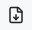 | 匯出 PDF | | 見 [第 9 節](#9-匯出-pdf--word) |
|  | 匯出 Word | | 見 [第 9 節](#9-匯出-pdf--word) |

### 格式

先**選取文字**再按按鈕，會把選取的文字加上格式；沒有選取時會插入範例文字。再按一次同一個按鈕可取消格式。

| 按鈕 | 名稱 | 快捷鍵 | 產生的 Markdown |
| :---: | --- | --- | --- |
|  | 粗體 | `Ctrl+B` | `**文字**` |
|  | 斜體 | `Ctrl+I` | `*文字*` |
|  | 刪除線 | `Ctrl+Shift+X` | `~~文字~~` |
| 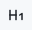 | 標題 1 | `Ctrl+1` | `# 標題` |
| 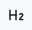 | 標題 2 | `Ctrl+2` | `## 標題` |
| 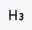 | 標題 3 | `Ctrl+3` | `### 標題` |
|  | 項目清單 | | `- 項目` |
| 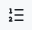 | 編號清單 | | `1. 項目` |
|  | 任務清單 | | `- [ ] 待辦事項` |
|  | 引用 | | `> 引用文字` |
|  | 行內程式碼 | `Ctrl+E` | `` `程式碼` `` |
| 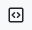 | 程式碼區塊 | `Ctrl+Shift+E` | ```` ``` ```` 包住的區塊 |
|  | 連結 | `Ctrl+K` | `[文字](https://)` |
|  | 圖片 | | `` |
|  | 表格 | | 插入 3 欄的表格範本 |
|  | 分隔線 | | `---` |
|  | 數學公式 | | `$$ 公式 $$` |

---

## 4. 開啟與儲存檔案

### 開啟檔案的方法

- 工具列 **開啟**（`Ctrl+O`），可一次選多個檔案。
- 從檔案總管把檔案**拖曳**進程式視窗（可一次拖多個）。
- 設為預設程式後，直接**雙擊 `.md` 檔**。程式已經開著時，檔案會在原本的視窗開成新分頁。
- 在預覽區點選其他 `.md` 檔的連結，會開成新分頁。

除了 `.md`，也可以直接開啟 Word、Excel、PowerPoint、PDF、HTML、CSV，程式會自動轉成 Markdown（見 [第 10 節](#10-把-wordexcelpdf-轉成-markdown)）。

### 儲存

- **儲存**（`Ctrl+S`）：存回原檔。新文件第一次儲存時會詢問位置。
- **另存新檔**（`Ctrl+Shift+S`）：存成另一個檔案。
- 檔案一律以 **UTF-8** 儲存，並保留原檔的換行格式；舊的 Big5 編碼檔案也能正確開啟，存檔後會轉為 UTF-8。

### 未儲存的變更

有修改但還沒儲存的分頁，檔名旁會出現「●」，視窗標題會出現「*」。關閉分頁或關閉程式時，程式會提醒：


- **儲存**：先存檔再關閉
- **不儲存**：放棄修改
- **取消**：回到編輯，不關閉

---

## 5. 多分頁

每份開啟的文件都是一個分頁，可以同時開多份文件互相參考。

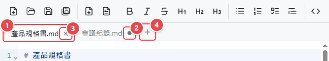

| 編號 | 說明 |
| :---: | --- |
| 1 | 目前正在編輯的分頁（白底） |
| 2 | 「●」表示這個分頁有尚未儲存的修改；滑鼠移上去會變成 × |
| 3 | × 關閉分頁（也可以在分頁上按滑鼠**中鍵**，或按 `Ctrl+W`） |
| 4 | ＋ 新增空白分頁（`Ctrl+N`） |

- `Ctrl+Tab` 切到下一個分頁、`Ctrl+Shift+Tab` 切到上一個分頁。
- 每個分頁會各自記住內容、游標位置、捲動位置與「復原」紀錄（`Ctrl+Z`）。
- 已經開著的檔案再開一次，會直接切換到那個分頁，不會重複開啟。
- 關閉最後一個分頁時，會自動留下一個空白分頁。

---

## 6. 撰寫 Markdown

不熟 Markdown 也沒關係，可以直接使用工具列按鈕。以下是最常用的寫法：

| 想要的效果 | 這樣寫 |
| --- | --- |
| 大標題 / 中標題 / 小標題 | `# 標題`、`## 標題`、`### 標題` |
| **粗體**、*斜體*、~~刪除線~~ | `**粗體**`、`*斜體*`、`~~刪除線~~` |
| 項目清單 | 每行開頭 `- ` |
| 編號清單 | 每行開頭 `1. `、`2. ` |
| 待辦清單 | `- [ ] 未完成`、`- [x] 已完成` |
| 連結 | `[顯示文字](https://網址)` |
| 圖片 | `` |
| 表格 | `\| 欄位 \| 欄位 \|`，第二行 `\| --- \| --- \|` |
| 引用 | 每行開頭 `> ` |
| 程式碼 | 用三個反引號 ```` ``` ```` 包住，可加上語言名稱（如 ```` ```python ````）會自動上色 |
| 分隔線 | `---` |

### 圖片

圖片建議和文件放在一起，例如文件旁建立 `images` 資料夾，再用相對路徑引用：``。這樣把整個資料夾複製給別人時，圖片也能正常顯示。

### 其他編輯功能

- `Ctrl+F` 搜尋、取代
- `Ctrl+Z` 復原、`Ctrl+Y` 重做
- `Tab` / `Shift+Tab` 增加 / 減少縮排
- 在編輯區按滑鼠右鍵可剪下、複製、貼上

---

## 7. 檢視模式

右上角的三個按鈕可切換檢視方式：

| 按鈕 | 模式 | 適合情況 |
| :---: | --- | --- |
|  | 只編輯 | 專心撰寫，編輯區佔滿整個視窗 |
|  | 分割（預設） | 左邊編輯、右邊預覽，兩邊捲動同步 |
|  | 只預覽 | 閱讀文件，像看一般文件一樣 |

**只編輯模式**

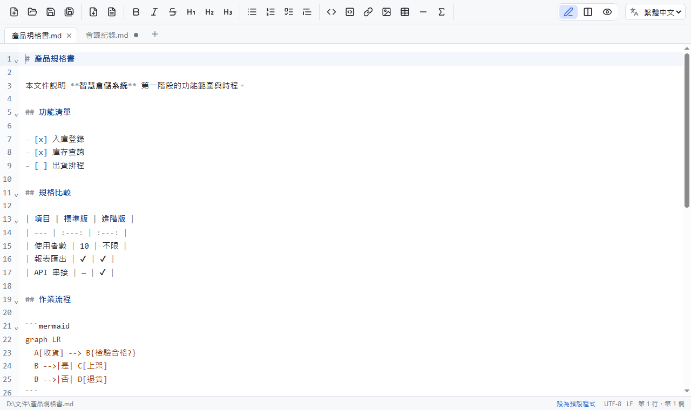

**只預覽模式**

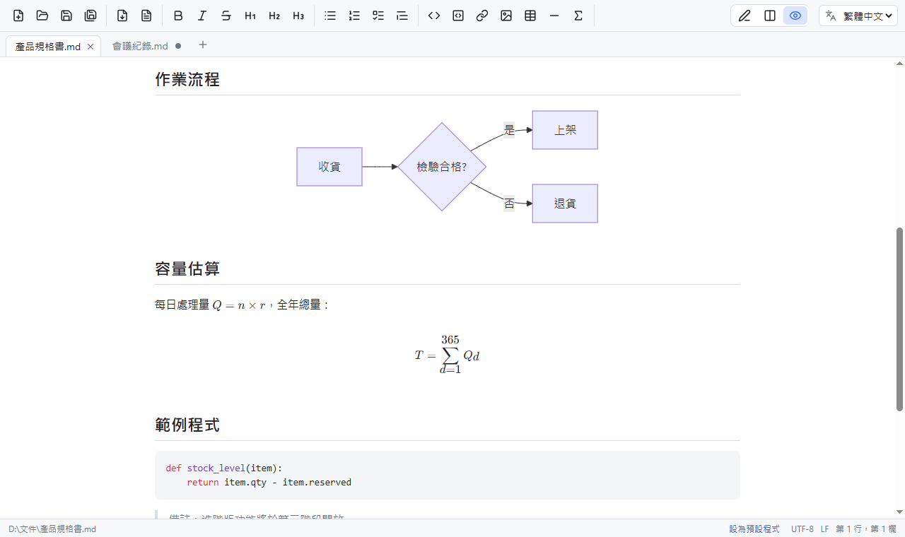

> 💡 在「只預覽」模式按格式按鈕時，會自動切回分割模式讓你編輯。

---

## 8. 圖表與數學公式

### 流程圖、循序圖、甘特圖（Mermaid）

用 ```` ```mermaid ```` 程式碼區塊描述圖表，預覽區會自動畫出來：

````markdown

````

結果如上方「只預覽模式」圖中的「作業流程」。常用的圖表類型：

| 類型 | 第一行寫 |
| --- | --- |
| 流程圖（由左到右 / 由上到下） | `graph LR` / `graph TD` |
| 循序圖 | `sequenceDiagram` |
| 甘特圖 | `gantt` |
| 圓餅圖 | `pie` |

圖表語法寫錯時，該位置會顯示紅色的「圖表語法錯誤」與錯誤說明，其他內容不受影響。完整語法可參考 Mermaid 官方網站（mermaid.js.org）。

### 數學公式

使用 LaTeX 語法：

| 寫法 | 說明 |
| --- | --- |
| `$E = mc^2$` | 行內公式（夾在文字中） |
| `$$ ... $$` | 獨立一行、置中的公式（可跨多行） |
| ```` ```math ```` 區塊 | 與 `$$` 相同（GitHub 相容寫法） |

範例：`$$ T = \sum_{d=1}^{365} Q_d $$`。工具列的  按鈕會插入公式範本。

> 💡 文字中的金額（例如「售價 $100 與 $200」）不會被誤判成公式。

---

## 9. 匯出 PDF / Word

要把文件交給沒有 Markdown 工具的人時，可以匯出成 PDF 或 Word：

1. 切換到要匯出的分頁。
2. 按工具列  **匯出 PDF** 或  **匯出 Word**。
3. 選擇存檔位置（預設與原文件同資料夾、同檔名）。
4. 完成後會詢問是否立即開啟：

   

### 匯出結果

<table>
<tr><th>PDF</th><th>Word</th></tr>
<tr>
<td>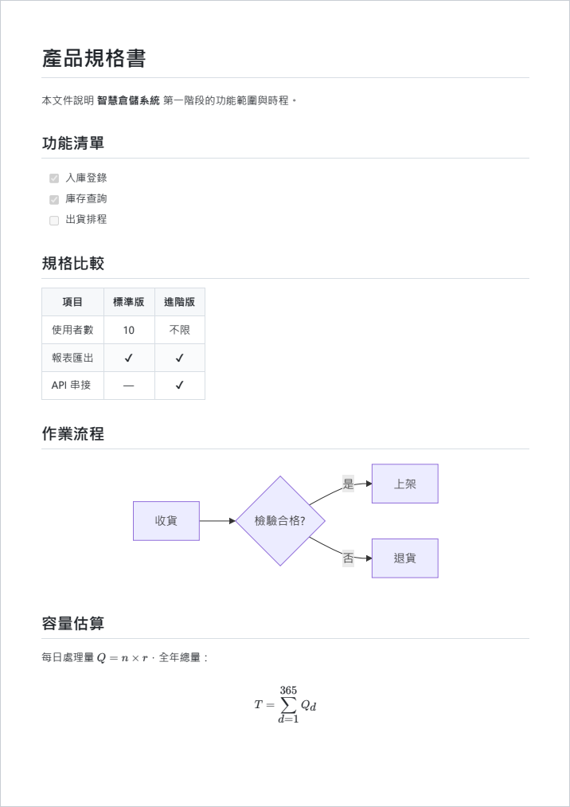</td>
<td>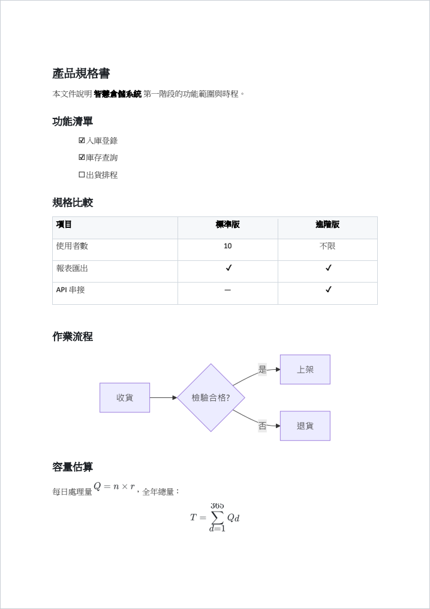</td>
</tr>
</table>

| | PDF | Word（.docx） |
| --- | --- | --- |
| 版面 | 與預覽區一致，A4 | Word 原生格式，可繼續編輯 |
| 文字 | 可選取、可搜尋 | 標題套用 Word「標題 1、2、3」樣式，可自動產生目錄 |
| 表格、清單、程式碼、連結 | ✔ | ✔ |
| 圖片 | ✔ | ✔ |
| Mermaid 圖表、數學公式 | ✔（向量） | ✔（以高解析度圖片嵌入） |

> ⚠️ 匯出 PDF 需要 Windows 內建的 Microsoft Edge 瀏覽器。

---

## 10. 把 Word、Excel、PDF 轉成 Markdown

直接**開啟**或**拖曳**下列檔案，程式會自動轉成 Markdown，開在新分頁：

| 格式 | 轉換結果 |
| --- | --- |
| Word（.docx） | 標題、段落、粗體、清單、表格、連結、圖片 |
| Excel（.xlsx / .xls / .ods） | 每個工作表一個標題 + 表格 |
| PowerPoint（.pptx） | 每張投影片一個標題，條列文字保留層級，投影片中的表格轉成表格 |
| PDF | 文字內容（依字體大小判斷標題、依行距分段；不保留版面與圖片） |
| 網頁（.html） | 標題、段落、清單、表格、連結 |
| CSV | 表格 |

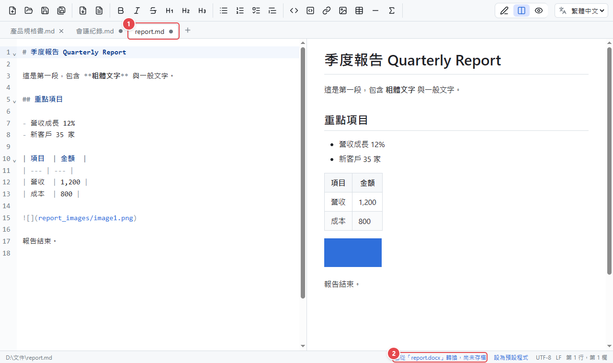

1. 轉換後的分頁名稱為「**原檔名.md**」，並標示為尚未儲存（●）。
2. 狀態列顯示「已從 xxx 轉換，尚未存檔」。按 `Ctrl+S` 就會存到原檔旁邊。
   - 同一資料夾已有同名 `.md` 時，會自動改成「原檔名-1.md」，不會覆蓋既有檔案。
3. Word 裡的圖片會另存到「**原檔名_images**」資料夾，文件中以相對路徑引用。

> ⚠️ 舊版 Office 格式（.doc、.ppt）無法直接轉換，請先用 Office 開啟後「另存新檔」為 .docx / .pptx。掃描成圖片的 PDF 沒有文字可以轉換。

---

## 11. 設為預設程式

設為預設程式後，雙擊任何 `.md` 檔都會用 MarkDown Builder 開啟。

1. 點狀態列右下角的「**設為預設程式**」（尚未設定時才會出現；第一次啟動時也會主動詢問）。
2. 出現 Windows 的「您要如何開啟這個檔案？」視窗，選 **MarkDown Builder**。
3. 勾選「**一律使用此應用程式開啟 .md 檔**」，按「確定」。

> 💡 Windows 規定預設程式必須由使用者自己確認，所以無法自動設定。
>
> 💡 程式每次啟動都會自動更新註冊資訊。如果搬移了 `MarkDownBuilder.exe` 的位置，重新開啟一次程式即可。

---

## 12. 自動更新

電腦有連上網路時，程式會在啟動後以及每 6 小時自動檢查是否有新版本。有新版本時，右下角會出現提示：

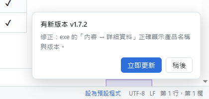

- **立即更新**：
  1. 如果有未儲存的分頁，會先詢問是否儲存。
  2. 自動下載新版（卡片上會顯示下載進度），並驗證檔案完整性。
  3. 程式自動關閉、換成新版後重新開啟，並顯示「已更新到 vX.X.X」。
- **稍後**：這次先不更新，之後的定期檢查會再提醒。

> 💡 沒有網路時不會檢查，也不會出現任何訊息。
>
> 💡 如果 `MarkDownBuilder.exe` 放在 `C:\Program Files` 這類需要系統管理員權限的資料夾，更新時會出現「使用者帳戶控制」視窗，請按「是」。

---

## 13. 切換介面語言

右上角的語言選單可以切換 **繁體中文** / **English**，所有按鈕、提示、對話框會立即切換，下次開啟時會記住選擇。第一次啟動時會依照 Windows 的語言自動選擇。

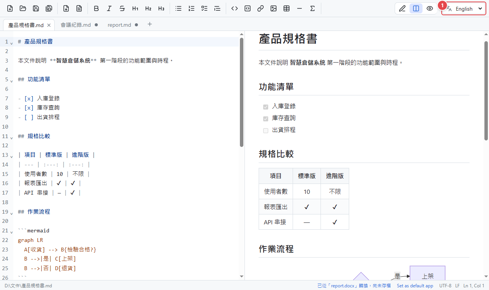

---

## 14. 快捷鍵一覽

| 分類 | 功能 | 快捷鍵 |
| --- | --- | --- |
| 檔案 | 新增分頁 | `Ctrl+N` |
| | 開啟 | `Ctrl+O` |
| | 儲存 | `Ctrl+S` |
| | 另存新檔 | `Ctrl+Shift+S` |
| 分頁 | 關閉分頁 | `Ctrl+W` |
| | 下一個 / 上一個分頁 | `Ctrl+Tab` / `Ctrl+Shift+Tab` |
| 格式 | 粗體 / 斜體 / 刪除線 | `Ctrl+B` / `Ctrl+I` / `Ctrl+Shift+X` |
| | 標題 1 / 2 / 3 | `Ctrl+1` / `Ctrl+2` / `Ctrl+3` |
| | 行內程式碼 / 程式碼區塊 | `Ctrl+E` / `Ctrl+Shift+E` |
| | 連結 | `Ctrl+K` |
| 編輯 | 復原 / 重做 | `Ctrl+Z` / `Ctrl+Y` |
| | 搜尋 / 取代 | `Ctrl+F` |
| | 增加 / 減少縮排 | `Tab` / `Shift+Tab` |

---

## 15. 常見問題

**Q：雙擊程式後出現「需要 WebView2 Runtime」或沒有畫面？**
A：程式需要 Microsoft Edge WebView2 Runtime。Windows 11 已內建；Windows 10 若缺少，請依畫面指示下載安裝，或洽 IT 人員。

**Q：Windows 顯示「Windows 已保護您的電腦」？**
A：點「其他資訊」→「仍要執行」。若被公司防毒軟體攔截，請洽 IT 人員加入允許清單。

**Q：預覽中的圖片沒有顯示？**
A：請確認圖片路徑正確。相對路徑是以「目前文件所在的資料夾」為基準；新文件尚未儲存時沒有資料夾位置，相對路徑的圖片要先存檔後才會顯示。

**Q：匯出 PDF 失敗？**
A：匯出 PDF 需要 Microsoft Edge。另外請確認目標檔案沒有被其他程式（例如 PDF 閱讀器）開著。

**Q：開啟 .doc 或 .ppt 顯示「不支援的格式」？**
A：請先用 Word / PowerPoint 開啟，「另存新檔」為 .docx / .pptx 後再開啟。

**Q：中文變成亂碼？**
A：程式支援 UTF-8 與 Big5 編碼的檔案。如果是其他編碼，請先用記事本「另存新檔」並選擇 UTF-8 編碼。

**Q：一直沒有收到更新提示？**
A：確認電腦能連上網際網路（github.com）。公司網路若需要特殊的 Proxy 自動設定（PAC），程式可能無法檢查更新，請洽 IT 人員。

**Q：設定存在哪裡？**
A：`%APPDATA%\MarkDownBuilder\`。刪除這個資料夾可恢復成第一次啟動的狀態。
